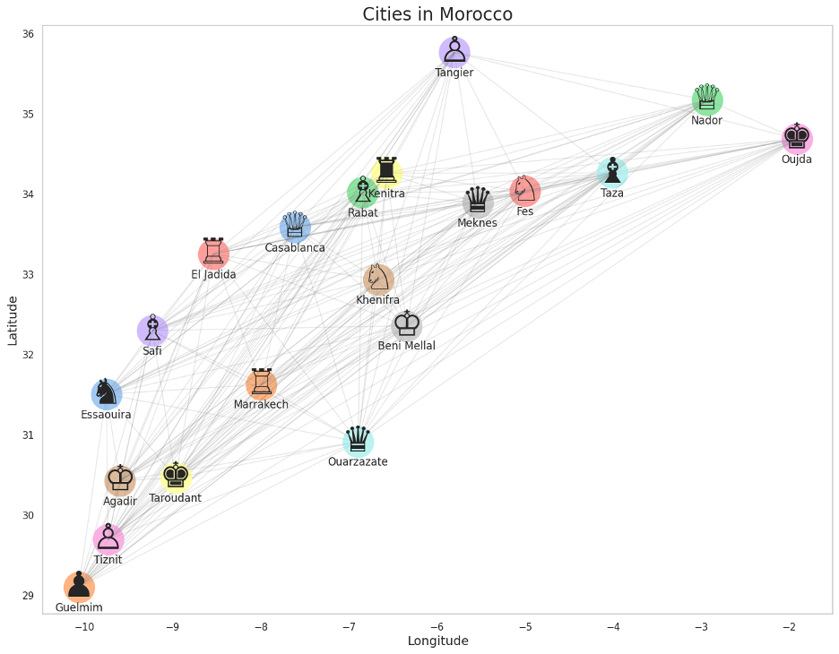

# Traveling Salesman Problem using Genetic Algorithm - Morocco Cities



## Overview
This project implements a Genetic Algorithm (GA) to solve the Traveling Salesman Problem (TSP) for 20 major cities in Morocco. The algorithm finds an optimal route that visits each city once and returns to the starting point while minimizing the total distance traveled.

## Features
- Implementation of GA with custom operators for the TSP
- Visualization of the optimal route on a map
- Real geographical coordinates (longitude and latitude) for accurate distance calculations
- Interactive visualization with city markers and path plotting
- Customizable GA parameters (population size, crossover rate, mutation rate)

## Algorithm Parameters
- Population Size: 250
- Crossover Rate: 0.8 (80%)
- Mutation Rate: 0.2 (20%)
- Number of Generations: 200
- Elitism: Preserves top 10% of solutions

## Dependencies
- NumPy
- Matplotlib
- Seaborn
- Python 3.x

## Installation
```bash
git clone https://github.com/medtty/ga-for-tsp
cd ga-for-tsp
pip install -r requirements.txt
```

## Usage
Run the main script:
```bash
python ga-for-tsp.py
```

## Code Structure
```python
# Key Components

# 1. Distance Calculation
def euclidean_distance(city1, city2):
    return np.linalg.norm(np.array(city1) - np.array(city2))

# 2. Fitness Function
def fitness(path, city_coords):
    total_distance = sum(euclidean_distance(city_coords[path[i]], 
                         city_coords[path[i+1]]) 
                         for i in range(len(path)-1))
    total_distance += euclidean_distance(city_coords[path[-1]],
                                         city_coords[path[0]])
    return total_distance

# 3. Genetic Operators
def crossover(parent1, parent2):
    # Custom crossover maintaining path validity
    start, end = sorted(random.sample(range(len(parent1)), 2))
    child = [-1] * len(parent1)
    child[start:end] = parent1[start:end]
    # ... rest of crossover implementation

def mutate(path, mutation_rate=0.01):
    # Random swap mutation
    for i in range(len(path)):
        if random.random() < mutation_rate:
            j = random.randint(0, len(path) - 1)
            path[i], path[j] = path[j], path[i]
    return path
```


## Output
The program will:
1. Display progress updates every 10 generations
2. Show the best path found
3. Generate a visualization of the optimal route
4. Create an additional visualization with city markers using chess piece symbols

## Dataset
The dataset includes 20 Moroccan cities:
- Major urban centers: Casablanca, Marrakech, Rabat, Fes, Tangier
- Regional capitals and important cities
- Geographical coordinates for accurate distance calculations

## Acknowledgments
This project was developed as part of a machine learning course experiment at NUIST (Nanjing University of Information Science & Technology).
